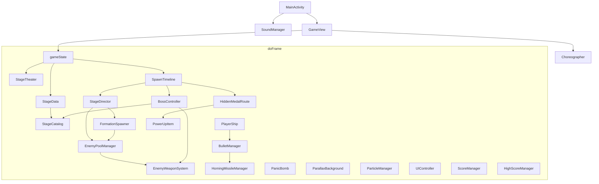

# WW2 Blitz

Portrait Android shoot-’em-up (`com.cc.ww2blitz`), version **1.0.6**. One fighter, eight timed stages, peelable bosses. Maps are composed (`StageDef` + director + theater/boss kit), not subclassed from a `BaseLevel`. The product is a 1990s arcade cabinet: attract while idle, one linear credit, briefing cards, time-scripted waves, a tiny hitbox, a panic bomb, a recap ticker, and three-letter name entry.

**Play Store.** Orbit Threshold is an ascent: mute alien escorts rise from the bottom, flank you in three pairs, swipe off the sides, then the fortress takes the sky.

The software is a Kotlin engine on one `SurfaceView`, clocked by `Choreographer`. Combat is not a Compose tree. The hot path does not allocate.

<p align="center">
  
</p>

Every architectural chapter below uses the same shape: **need** (what a 90s cabinet had to do), **choice** (the rule this engine adopted), **why** (how that rule satisfies the need without fighting Android), **implementation** (where and how the code does it).

---

## Catalog of architectural choices

This is the full inventory. Nothing in the engine is “just a UI preference”; each row is a cabinet constraint.

| # | Need | Choice | Chapter |
| --- | --- | --- | --- |
| 1 | One OS window, stay awake, music keys | Immersive `Activity`, `FLAG_KEEP_SCREEN_ON`, `STREAM_MUSIC` | [Host](#1-host-activity) |
| 2 | Tick with the glass, not a widget tree | `SurfaceView` + `Choreographer` + hardware canvas | [Frame loop](#2-frame-loop) |
| 3 | No GC hitch in a bullet hell | Zero heap on `doFrame`; fixed pools; `while` loops | [Zero allocation](#3-zero-allocation) |
| 4 | One object knows the scene | `GameView` owns `gameState`; departments do not | [Scene owner](#4-scene-owner) |
| 5 | Cheap, allocation-free scenes | `gameState` is an `Int`, not an enum | [Scene machine](#5-scene-machine) |
| 6 | Cabinet sells itself while idle | Attract cycle: title 4 s → CPU demo 30 s → ranking 4 s | [Attract](#6-attract) |
| 7 | Demo must look like the real game | Same spawn/combat path; `STATE_DEMO`; no leaderboard insert | [Attract](#6-attract) |
| 8 | One credit, no stage-select grid | `STAGE_SEQUENCE` int array; finish is a latch past last index | [Playlist](#7-playlist-and-stage-identity) |
| 9 | Maps have identities, not playlist slots | `StageDef` in `StageCatalog`; compose director + theater + boss kit | [Playlist](#7-playlist-and-stage-identity) |
| 10 | Operator dipswitch for hardness | Nested `Difficulty` enum: speed, interval, burst, score × | [Difficulty](#8-difficulty-dipswitch) |
| 11 | Operator dipswitch for ship | Persisted `chosen_fighter`; `applyFighterConfiguration` | [Fighter](#9-fighter-dipswitch) |
| 64 | Operator honesty on continues | Dip 0/1/2 extra bodies (default 0); ranking is 1CC only | [Lives](#16-lives-hits-respawn) |
| 12 | Settings survive power cycle | `SharedPreferences` primitives, load once, `apply()` | [Persistence](#10-persistence) |
| 13 | Sell the next map, freeze combat | `STATE_INTERSTITIAL`, 3 s, timer only | [Briefing](#11-briefing-interstitial) |
| 14 | Thumb must not hide the plane; finger must not run away from it | Arcade rubber band (thumb leash): chase `finger − grabOffset`, 40 px error cap, class speed | [Player motion](#12-player-motion) |
| 15 | Bank must read at a glance | Seven-frame strip, lerp toward hard left or hard right | [Player motion](#12-player-motion) |
| 16 | Hold-to-fire, two ship identities | Class vulcan in `BulletManager`; no trig on the fire path | [Vulcan](#13-vulcan-and-missiles) |
| 17 | Missiles are a power reward, not the gun | Separate cooldown at power ≥ 3; nearest on-screen target | [Vulcan](#13-vulcan-and-missiles) |
| 18 | Bomb must not fire from vulcan taps | Double-tap window + slop; discrete `PanicBomb` | [Bomb](#14-panic-bomb) |
| 19 | Bomb must clear without deleting a core | DPS + per-frame bank, cap, AABB vs pools | [Bomb](#14-panic-bomb) |
| 20 | Sprite is large; hurtbox is a dot | 8 px core + 10 px pellet radius; 24 px graze ring | [Graze](#15-core-hitbox-and-graze) |
| 21 | Graze is a skill drip, once per shot; a chip must not abort the ring | `FLAG_GRAZED` latch; one `takeDamage` per frame; loop only dies on explode | [Graze](#15-core-hitbox-and-graze) |
| 22 | Chip damage ≠ credit over | 3 lives × 3 hits; `GAME OVER` only if `isGameOver()` | [Lives](#16-lives-hits-respawn) |
| 23 | Hardware sprite RAM, not `new` | Fixed pools: enemies 48, enemy shots 720, player shots 100, … | [Pools](#17-sprite-ram-pools) |
| 24 | Never clobber a live sprite | `MAX_ACTIVE` skip; deactivate rather than overwrite | [Pools](#17-sprite-ram-pools) |
| 25 | Waves have a rhythm independent of skill | Clock + one-shot flags, not “spawn when empty” | [Director](#18-time-scripted-director) |
| 26 | Boss must not share the screen with infinite fodder | Freeze `elapsedTime` at the gate (`locksElapsedAtBoss`) | [Director](#18-time-scripted-director) |
| 27 | Formations must be readable, not random scatter | Related pool slots + pattern ids; no Formation object | [Formations](#19-formations) |
| 28 | Silhouettes stay readable on a phone | Four enemy types; complexity in *when* and *pattern* | [Formations](#19-formations) |
| 29 | Aim, lead, revenge scale with the dip | Dip plus secret rank; popcorn suicide on Normal+ | [Grunt combat](#20-grunt-combat-and-aim) |
| 30 | Killing a gunship must feel like peeling a machine | Multi-hitbox `BossComponent`; derived core vulnerability | [Boss peel](#21-boss-peel) |
| 31 | Armor hits must confirm without a white flash | 2 px micro-shudder, 0.08 s | [Hit confirm and camera](#22-hit-confirm-and-camera) |
| 32 | Cabinet kick on phase/death | Shake/flash as durations + LCG translate; HUD unshaken | [Hit confirm and camera](#22-hit-confirm-and-camera) |
| 33 | Facility/ascent roof occludes hostiles, not you | Floor → enemies/boss/shots → canopy → player | [Theaters](#23-theaters-and-z-order) |
| 34 | Painted maps must not stretch | Width-lock every theater floor (uniform scale); title is a still, center-cropped | [Theaters](#23-theaters-and-z-order) |
| 35 | Green key at authoring time | Punch chroma once at bitmap load | [Chroma](#24-green-chroma) |
| 36 | Recap must be readable | Sweep all combat pools on `STATE_CLEAR` | [Score and recap](#25-score-and-recap) |
| 37 | Bonus roll like a cabinet ticker | Five-phase recap; combat × dip; ticks `SFX_PICKUP` | [Score and recap](#25-score-and-recap) |
| 38 | Kill must tick the HUD without replacing medals | Token 100 / 300 / 1_000 × dip + popup; medals stay the skill money | [Score and recap](#25-score-and-recap) |
| 39 | Power carries; death resets gun | Continue keeps power; death → power 1 plus a catchable **P** | [Lives](#16-lives-hits-respawn) |
| 40 | Ten-row table **per dip**, no JSON on attract | 7 × 10 `IntArray` / `CharArray`, in-place insert, `arcade_leaderboard` | [Name entry](#26-name-entry-and-campaign-end) |
| 41 | Finish is the playlist latch, not “stage id 6” | `campaignFinishedLatch` → credits → qualify | [Name entry](#26-name-entry-and-campaign-end) |
| 42 | Gunshots immediate, music gapless, nothing on the frame | `SoundPool` + dual `MediaPlayer`; volumes in prefs | [Audio](#27-audio) |
| 43 | Collisions need every pool; fat gunships must take body hits | Armor shots `10 + 0.55×half`; popcorn `3 + 0.28×half`; ram 45% | [Collisions](#28-collision-ownership) |
| 44 | Dual columns are lines, not a broom | Popcorn shot ellipse pad 3 / 28% hull; armor keeps 10 / 55% | [Collisions](#28-collision-ownership) |
| 45 | Max gun must not freeze the pot | Secret `combatRank` on `StageData`; climb only at power 3 | [Live rank](#29-live-rank) |
| 46 | Deleting popcorn at the lip still threatens | Aimed suicide pellet on Normal+ drones/kami (vulcan/missile) | [Grunt combat](#20-grunt-combat-and-aim) |
| 47 | Power 2 must change the vulcan | Faster interval at 2; power 3 is class-base gun + missiles | [Vulcan](#13-vulcan-and-missiles) |
| 48 | Death is not a dry respawn | Swaying **P** 160 px above the ship after 0.4 s | [Lives](#16-lives-hits-respawn) |
| 49 | Static hose must miss the rails | Side/cross director beats; kamikazes seek on Normal | [Formations](#19-formations) |
| 50 | Extra drops follow the pot | `lootChanceScale` × dip, cap 20% popcorn / 50% armor | [Score and recap](#25-score-and-recap) |
| 51 | Recap must not sound like the gun | Tally ticks `SFX_PICKUP`, not vulcan | [Audio](#27-audio) |
| 52 | A clean loop must pay a 1UP | 50k, then every 100k; `grantExtraLife` cap 6; credit-only | [Lives](#16-lives-hits-respawn) |
| 53 | Teach beats must not vanish at the pool cap | Scripted one-shots ignore `MAX_ACTIVE` | [Director](#18-time-scripted-director) |
| 54 | Attract card must show the ROM revision | `VER` + installed `versionName` under CREDIT, same small typeface | [Attract](#6-attract) |
| 55 | Tanks and ships sit on the ground, not in the flight | Two-pass grunt blit: `isGroundHeavy()` then airborne | [Theaters](#23-theaters-and-z-order) |
| 56 | A seventh map must not subclass the engine | Folder + `StageDef` + director slot; reuse theater/boss kinds | [Playlist](#7-playlist-and-stage-identity) |
| 57 | A new map must ship with a fixed art/authoring order | Floor wrap → overlays → `boss.png` → muzzles → briefing (3D boss) → band wrecks | [New stage prompt](#30-new-stage-prompt) |
| 58 | A clean stage must pay skill, not only leftovers | Unscaled NO MISS 200k / NO BOMB 100k on recap; gold if earned | [Score and recap](#25-score-and-recap) |
| 59 | Replay needs a gold route, not only wreck coins | Timed rail medals per map (`HiddenMedalRoute`); SECRET recap | [Score and recap](#25-score-and-recap) |
| 60 | Monkey 900k must not sit on Hardcore | One EEPROM table per `Difficulty.index`; attract shows the live dip | [Name entry](#26-name-entry-and-campaign-end) |
| 61 | Maps must not share a song | `bgm_stage1`…`8` on `StageDef.stageMusicTrack` | [Audio](#27-audio) |
| 62 | Peel must change the pot | Warning sting + `bgm_boss` / `bgm_boss2` when the core opens | [Audio](#27-audio) |
| 63 | Mid-stage armor without a ninth map | Captain `isMidBoss` on 3–6; dive off before fortress; no second peel | [Director](#18-time-scripted-director) |
| 65 | Orbit must feel like an ascent, not an empty gate | Mute escort pairs (`FLIGHT_PROFILE_ORBIT_ESCORT`); `introOnly` still ticks the director | [Director](#18-time-scripted-director) |



---

## 1. Host activity

**Need.** A cabinet has one glass, never sleeps, and routes volume to the game. Android’s default is a composable UI that can pause, letterbox, and steal keys.

**Choice.** A single immersive `Activity` that owns the window and audio lifetime, then hands pixels to `GameView`.

**Why.** One content view means one canvas and one input stream. Keeping the screen on and binding `STREAM_MUSIC` matches “the machine is on.” Pause/destroy is where volumes are saved and `SoundPool`/`MediaPlayer` die, so combat never constructs audio objects.

**Implementation.** `MainActivity.onCreate`: `requestedOrientation = PORTRAIT`, `setDecorFitsSystemWindows(false)`, hide system bars, `FLAG_KEEP_SCREEN_ON`, `volumeControlStream = STREAM_MUSIC`, `SoundManager.instance.initialize(this)`, `setContentView(GameView(this))`. Manifest: `screenOrientation=portrait`, `resizeableActivity=false`, `appCategory=game`, plus Android 16 large-screen opt-outs so tablets do not ignore the portrait lock. `onPause` saves audio and pauses; `onResume` resumes; `onDestroy` releases. No fragments, no Compose. Viewport size is applied once through `applyViewportSize`: first valid size boots the title stage; later same-size `surfaceChanged`/`onSizeChanged` pairs do not rewind attract or teleport the ship. `surfaceCreated` does not reset the attract cursor.

---

## 2. Frame loop

**Need.** A 90s board ticked with the CRT. A hitch or a huge `dt` after a debugger pause teleports every bullet. Compose “recompose this tree” is the wrong clock.

**Choice.** `GameView` implements `SurfaceHolder.Callback` and `Choreographer.FrameCallback`. `dt` is nanoseconds converted to seconds and **clamped**. API 26+ locks a hardware canvas.

**Why.** Vsync is the cabinet’s scanline analog. Clamping `dt` (50 ms / `MAX_FRAME_NS`) bounds simulation when a frame is late. Hardware canvas keeps blit on the GPU path. `setWillNotDraw(true)` avoids a second software `onDraw`.

**Implementation.** `surfaceCreated` sets `running`, zeros `lastNanos`, `postFrameCallback`. `doFrame` computes `dt`, runs the `when (gameState)` update, draws, `unlockCanvasAndPost`, posts the next callback. `surfaceDestroyed` removes the callback. Departments receive the same `dt`. Title / difficulty / character select do **not** tick parallax. Interstitial only decrements `interstitialTimer`. Play tick order: parallax → **thumb leash** (`followTether`) → `player.update` → player bullets/missiles → pickups (medal magnet) → floating scores → timeline → enemies → boss → enemy shots → bomb → particles → collisions → boss FX flags → clear. Demo uses `demoPilot` / `steerToward` instead of the leash.

Paint: optional world `save`/`translate`/`restore` for shake → background → sprites → flash quad → HUD.

---

## 3. Zero allocation

**Need.** Android’s GC pausing a 720-bullet frame feels like lag. Cabinets did not have a garbage collector on the scanline.

**Choice.** `doFrame` must not allocate. Combat objects exist at construct time. HUD text is one `StringBuilder` plus `CharArray` buffers. Loops are indexed `while`. No `enum.values()`, no `String.format`, no boxing on the hot path.

**Why.** Fixed RAM is how sprite hardware worked. If a feature needs a list, it was the wrong feature for the frame.

**Implementation.** Pools are `Array(N) { Slot() }` created with the manager. Spawn writes fields on an inactive slot. Bitmap decode and `keyGreen` run at load. Recap HUD is `UIController` filling preallocated chars. Difficulty tap indexes `difficultyTiers[7]`, never `Difficulty.values()`. Hellcat spread uses hardcoded `280.68f` / `-1320.55f` instead of `Math.toRadians` on fire.

---

## 4. Scene owner

**Need.** Title, demo, play, recap, and name entry must share the same world systems without every class knowing “are we on the logo.”

**Choice.** Only `GameView` knows the scene. Departments expose activate / `update(dt)` / `draw` / deactivate.

**Why.** The CPU demo can call the same `SpawnTimeline` and `BulletManager` as a credit. Leaderboard insert is a `GameView` policy, not an enemy policy.

**Implementation.** `GameView` holds the managers as fields. Attract, credit start, `enterGameOver`, interstitial, and recap continue are methods here. `BulletManager` still owns the Euclidean graze loop because that math is one pool vs the player; it takes `awardScore` so demo can spark without paying.

---

## 5. Scene machine

**Need.** Many mutually exclusive cabinet screens, switched every frame, with no object per screen.

**Choice.** `gameState: Int` constants. Attract is a **second** int (`ATTRACT_*`) plus `attractCycleTimer` so title/demo/ranking do not need extra activities.

**Why.** `when` on an int is free. Nested attract inside title/demo avoids exploding the state table. Dipswitch menus are scenes that **must not** start a credit.

**Implementation.**

| Constant | Scene |
| --- | --- |
| `STATE_TITLE` (0) | Still, logo, 1P START (visual), audio / difficulty / continue / fighter hits |
| `STATE_PLAYING` (1) | Campaign |
| `STATE_CLEAR` (2) | Swept map + recap |
| `STATE_GAMEOVER` (3) | Death pause (~9 s, tap skip) |
| `STATE_DEMO` (4) | CPU attract |
| `STATE_REGISTRATION` (5) | Three initials |
| `STATE_CAMPAIGN_COMPLETE` (6) | Credits |
| `STATE_INTERSTITIAL` (7) | Briefing, 3 s |
| `STATE_DIFFICULTY_SELECT` (8) | Difficulty list over the still |
| `STATE_CHARACTER_SELECT` (9) | Fighter panels; return only via `[ RETURN TO TITLE ]` |
| `STATE_CONTINUE_SELECT` (10) | Continue dip 0 / 1 / 2 |
| `STATE_CONTINUE` (11) | `CONTINUE?` countdown after last life |

Empty-glass tap on title calls `beginCampaignFromMenu()` only after settings / difficulty / continue / fighter `RectF`s miss. Those rects are expanded with `inset(-60, -30)` so a miss does not burn a credit. Character-select plane taps mutate `selectedFighterIndex` + `applyFighterConfiguration` + prefs and **do not** change `gameState`. Dipswitch menus (`STATE_DIFFICULTY_SELECT`, `STATE_CHARACTER_SELECT`, `STATE_CONTINUE_SELECT`) are scenes that **must not** start a credit.

---

## 6. Attract

**Need.** A 1996 cabinet in a dark arcade must look busy: logo, a CPU flying the real game, then names of people who were good.

**Choice.** Timed cycle on the same engine. Demo uses combat code. Demo score is forbidden from the table.

**Why.** A fake “attract-only” spawn list would desync from the product. Reusing the director means the window always shows shippable waves. Forbidding insert keeps the operator table honest.

**Implementation.** Cold start paints `title_screen_backdrop` as `windowBackground` plus a center-cropped `ImageView`; `GameView` is posted onto that stack so the still is up before pools/audio hitch. `ATTRACT_TITLE_SECS = 4`, `ATTRACT_DEMO_SECS = 30`, `ATTRACT_HIGH_SCORE_SECS = 4`. Title footer: CREDIT line, then `VER` plus `PackageManager` `versionName` (cached at `GameView` init), both `uiSmallPaint` / arcade face. Ranking card is **TOP SCORES** plus the saved dip name; rows read `HighScoreManager` for that `Difficulty.index` only. On title timeout, `beginDemo()` picks a catalog map that is not `introOnly`, skipping `lastDemoStage` when more than one attract map exists. `demoPilot` steers toward the lowest living enemy or boss part, sidesteps nearby downward bullets, sine-wanders if idle (`DEMO_SPEED`). `resolveEnemyBulletsVsPlayer(..., awardScore = false)`. Touch on demo or ranking returns to interactive title. Surface recreate does **not** force `ATTRACT_TITLE`; ranking can survive a flap. `HighScoreManager` insert is not called on this path.

---

## 7. Playlist and stage identity

**Need.** A credit is a linear war, not a level-select app. Test playlists may repeat an id. “You beat stage 6” is not “the playlist is done” if 6 appears twice. A seventh map must not be `class Stage7 : BaseLevel()` that duplicates pools, dips, and vulcan.

**Choice.** Three layers, composed, never inherited:

| Layer | Owns | Does not own |
| --- | --- | --- |
| `STAGE_SEQUENCE` | Order of the credit; finish latch | Art, waves, boss guns |
| `StageDef` / `StageCatalog` | Identity: metrics, flags, asset paths, `theaterKind`, `bossCombat`, briefing name | Spawn script, live bitmaps |
| `StageDirector` | That map’s elapsed-time waves | Pools, HUD, player |

`StageTheater` loads `assets/stages/N/`. `BossController` peels using `BossCombatKind` (same ints as catalog ids 1–8). Shared systems stay global.

**Why.** Index-based finish is what the operator programmed. Identity on the def lets a facility canopy and an ocean freeze work even if you reorder the array. A clone of jungle-over-new-art is a folder, a catalog row, a director object, and a playlist entry.

**Implementation.** Default `intArrayOf(1, 2, 3, 4, 5, 6, 7, 8)`. `setCurrentStage` / `resetToStart` / `advanceToNextStage` maintain `sequenceIndex` and `stageId`. `currentStage` is the catalog id; `missionNumber` is `sequenceIndex + 1` (what recap prints as `STAGE N CLEAR`). `StageData.def` is `StageCatalog.get(stageId)`. Derived flags: `hasOverlayClouds`, `isFacilityTheater`, `isAscentTheater`, `locksElapsedAtBoss`, `usesOpeningPowerV`, `introOnly`. `applyStageMetrics` copies `scrollSpeedY`, `targetBossTimelineSeconds`, `stageMusicTrack`. `GameView.bootLaunchStageIfNeeded` runs **once** on the first valid viewport. Later title size bounces do not call it.

Theater kinds (`StageTheaterKind`): **SCROLL** (width-locked floor, optional overlay clouds), **FACILITY** (floor + keyed canopy over hostiles), **ASCENT** (unscaled floor, `floor_alt` swap, late canopy). GameView/Parallax branch on kind, not on ids 7 and 8.

Boss kits (`BossCombatKind`): **PLANE**, **TANK**, **BATTLESHIP**, **WINTER**, **ATOLL**, **JUNGLE**, **CANOPY**, **ORBIT** (ints 1–8, same as the maps). Bind peels, wreck overlays, and fire tables. `BossKit.triPart` is canopy/orbit victory. Reuse a kind on a new def to clone an existing fortress.

Waves: `SpawnTimeline` is the clock (opening P-V, power safeguard, shared boss cue, `introOnly` gate, `HiddenMedalRoute` tick). Each catalog id gets its own director instance from `StageDef.waveScript` (`StageWaveKind`), not from the id number. Gaps are idle. `FormationSpawner` is shared helpers. Directors stay Kotlin; there is no wave DSL.

Art: default folder `assets/stages/$id/`. Set `artFolder` (for example `"stages/4"`) to reuse another map’s PNGs without copying them. `StageBitmaps` decodes off the vsync path. Shared sprites stay in `res/drawable`. `ParallaxBackground` **borrows** theater bitmaps and must not recycle them. `resetStage` restarts theater playback so a duplicated id (including ascent) begins as a fresh run.

Campaign maps as coded:

| Id | Operation | Theater | Boss kit | BGM | Scroll | Boss cue |
| --- | --- | --- | --- | --- | --- | --- |
| 1 | CLOUD FORTRESS | SCROLL + clouds | PLANE | `bgm_stage1` | ~180 | ~38 s (shared cue) |
| 2 | IRON TREADS | SCROLL + tank skin | TANK | `bgm_stage2` | ~260 | ~30 s (shared cue) |
| 3 | STEEL ATLANTIC | SCROLL + destroyer skin | BATTLESHIP | `bgm_stage3` | ~200 | ~42 s (shared cue; clock freezes) |
| 4 | FROZEN FRONT | SCROLL + keyed snow overlays + tank skin | WINTER | `bgm_stage4` | ~240 | ~42 s (shared cue; clock freezes) |
| 5 | CORAL ATOLL | SCROLL + keyed cloud/spray overlays | ATOLL | `bgm_stage5` | ~220 | ~40 s (shared cue; clock freezes) |
| 6 | JUNGLE RUINS | SCROLL + helicopter skin | JUNGLE | `bgm_stage6` | ~310 | ~45 s (shared cue; clock freezes) |
| 7 | ASCENT CANOPY | FACILITY + wagon skin | CANOPY | `bgm_stage7` | 280 → 0 | ~45 s (director cue; clock freezes) |
| 8 | ORBIT THRESHOLD | ASCENT | ORBIT | `bgm_stage8` | envelope | **14.5 s** three mute escort pairs (saucers, pickets, UFOs), then fortress |

**To mix and match**

The credit order is only `STAGE_SEQUENCE` (reorder, skip, duplicate). Each id is a `StageDef` whose **theater**, **wave script**, **boss peel**, and **art folder** are independent:

```kotlin
StageDef(
  id = 8,
  artFolder = "stages/6",                       // jungle PNGs
  theaterKind = StageTheaterKind.SCROLL,
  waveScript = StageWaveKind.CLOUD_FORTRESS,    // stage 1 waves
  bossCombat = BossCombatKind.TANK,             // stage 2 peel
  // flags, BGM, bossAtSeconds, operationName, wreck kit...
)
```

Then `STAGE_SEQUENCE = intArrayOf(3, 8, 6, 6)`. No new director class if the wave kind already exists. A unique fortress or a fourth theater kind still needs a new kit in engine code.

**To add a map that reuses an existing theater, waves, and fortress as a block**

1. `assets/stages/N/` (or `artFolder` pointing at an existing kit).
2. Append a `StageDef` (`waveScript`, `theaterKind`, `bossCombat`, flags, BGM, `bossAtSeconds`, `operationName`).
3. `STAGE_SEQUENCE += N`.

**New-map art (always)** is the pasteable pipeline in [New stage prompt](#30-new-stage-prompt).

---

## 8. Difficulty dipswitch

**Need.** Psikyo cabinets had a pot: tutorial through gauntlet. Changing it must not allocate, must not start a credit, and must scale speed, cadence, density, aim, and score together.

**Choice.** Nested `StageData.Difficulty` with `index`, `speedMultiplier`, `intervalDivider`, `burstBonus`. Live instance (`liveInstance`) so pools read the dip without a `GameView` pointer. Seven constants in a `GameView` array for tap.

**Why.** Three floats cover the whole combat table. Score uses a parallel multiplier on `ScoreManager`. Recap line items stay raw so the ticker is not double-scaled.

**Implementation.** Saved as `target_difficulty`. `saveDifficultySetting` writes prefs and the live enum. Combat reads `shotSpeedScale()` / `fireIntervalDivider()` / `burstBonus()` so the dip **and** live rank share one multiply. Monkey/Easy: slop via `aimSlopRad()` (shrinks as rank climbs). Lead: Very Hard+ **or** rank ≥ 0.60. Kamikaze `steerToward`: Normal+ **or** rank ≥ 0.50. Revenge on interceptors/heavies: Very Hard+ **or** rank ≥ 0.70; Hardcore heavies a 3-way (death-clear ships skip). Drones/kami suicide on Normal+ even at rank 0 (see [grunt combat](#20-grunt-combat-and-aim)). Extra pickup chance × `lootChanceScale()` (Monkey 0.75 … Hardcore 1.25, capped). Boss muzzle speeds and timer resets in `EnemyWeaponSystem` use the same scales. `syncDifficultyMultiplier` on stage reset / boot. Rank is **not** written to prefs; it does carry between maps in one credit.

| Index | Label | Speed | Interval | Extra shots | Score × | Extra drop × |
| --- | --- | --- | --- | --- | --- | --- |
| 1 | MONKEY | 0.65 | ÷ 0.75 | −1 | 0.5 | 0.75 |
| 2 | EASY | 0.85 | ÷ 0.90 | 0 | 0.8 | 0.85 |
| 3 | NORMAL | 1.00 | 1.00 | 0 | 1.0 | 1.00 |
| 4 | HARD | 1.15 | ÷ 1.15 | 0 | 1.2 | 1.08 |
| 5 | VERY HARD | 1.30 | ÷ 1.25 | +1 | 1.5 | 1.15 |
| 6 | EXPERT | 1.45 | ÷ 1.40 | +1 | 2.0 | 1.20 |
| 7 | HARDCORE | 1.60 | ÷ 1.55 | +2 | 3.0 | 1.25 |

---

## 9. Fighter dipswitch

**Need.** Two planes with different guns and handling, chosen before the credit, remembered after a reboot—like a ship select that is not a second campaign start.

**Choice.** Integer 0/1 on `PlayerShip.chosenFighterIndex`, applied through `applyFighterConfiguration`, persisted as `chosen_fighter`. Selecting a panel does not leave `STATE_CHARACTER_SELECT`.

**Why.** Mutating live stats + sprites in one function keeps demo, play, and title tags coherent. Staying in the select scene matches difficulty: dip first, credit from the title.

**Implementation.** P-38: `player_ship_1…7`, `classBaseSpeed` 1600, `responsivenessTether` 1.0, class fire 0.090 s (power 2: 0.075 s), dual columns. Hellcat: `player_b_1…7`, speed 1150, tether 0.82, class fire 0.125 s (power 2: 0.105 s), 3-way. `applyFighterConfiguration` recycles the seven frames, `loadFrames()`, `refreshDrawSize()`. `GameView` init loads prefs then applies. Panel tap saves immediately. Gold focus stroke (4 px, 8 px corners, blinking alpha) reads `selectedFighterIndex`, synced from `chosenFighterIndex` when the scene opens.

---

## 10. Persistence

**Need.** Operator settings and the ranking table must survive process death. Attract must not parse JSON.

**Choice.** Primitive prefs. Arcade dips in `shmup_arcade_settings`. Audio in `StrikersAudioPrefs`. Seven leaderboards in `arcade_leaderboard`. Load once (`hydrated` on scores).

**Why.** Ten ints and thirty chars **per dip** are a cabinet EEPROM. Mixing Monkey with Hardcore would make the attract card a lie. `edit().apply()` is fire-and-forget off the frame.

**Implementation.** `StageData.initPersistentSettings` reads difficulty index, fighter 0/1, and continue dip 0/1/2 (`continue_credits`, default 0). `HighScoreManager` keeps seven tables (`d{1..7}_score_*` / `_stage_*` / `_name_*`). Insert shifts in place inside one table. Legacy unprefixed `score_0`… keys migrate onto **NORMAL** (`index` 3) on first hydrate, then all seven tables are written. Fallback names (`PSK`, `STK`, …) exist before first hydrate. Audio load/save is synchronized inside `SoundManager`.

---

## 11. Briefing interstitial

**Need.** Cabinets flashed a mission card before the map. Combat and attract must not run under it.

**Choice.** Dedicated `STATE_INTERSTITIAL`. Touch swallowed. Timer 3 s, then `STATE_PLAYING`.

**Why.** A flag on the play state would still tick bullets. A full state makes the freeze obvious and the draw path a single card.

**Implementation.** `INTERSTITIAL_SECS = 3`. Title start and recap-continue (when not finished) assign it. `StageTheater` loads `briefing.png` from `assets/stages/N/` with the rest of the map kit. Cards are **1080×2400** with **400 px** solid matching color bands top and bottom (illustration 1080×1600 in the middle). Draw **contains** the card (`min(scaleW, scaleH)`), centers it, and fills letterbox from the card’s top-left pixel so short tablets keep side bars instead of cropping the header. Gold `OPERATION:` + `StageDef.operationName` sit at `cardTop + 4.2 × textSize` (always on-screen, in the top band). Fade from remaining timer. `syncBgm` uses the **stage** track during interstitial so the card and the fight share music.

---

## 12. Player motion (thumb leash)

**Need.** Putting the plane under the thumb hides the sprite. Relative drag (ship += finger delta) lets the finger run away: the plane is no longer where you are pointing, and a 40 px clamp on **that delta** never acts like a leash. Cabinets and phone STGs treat the stick/thumb as a **rubber band to a grab point**.

**Choice.** Arcade rubber band. On a grab inside `touchGrabRadius`, store `grabOffset = finger − ship`. Every play frame, the target is **`finger − grabOffset`** (grab the wing, the plane does not jump under the thumb). `PlayerShip.followTether` chases that target. Error longer than `TETHER_LIMIT_PX` (40) is scaled down to 40 px — that is the throw of the leash, **ship vs target**, not “this `ACTION_MOVE` sample.” Then `maxMove = classBaseSpeed * dt`; if the (already leashed) step is still over budget, scale it and multiply Hellcat by `responsivenessTether` 0.82. Inside the budget the ship sits on the target (1:1 micro-dodges). `clamp()` in the same call so a bezel hit drops leftover error. Touch only **writes** the current finger; motion is applied **once** in `doFrame` so extra MOVE events cannot buy extra speed.

**Why.** The leash is what the operator’s hand expects: the plane wants to stay at the same offset from the thumb. A flick stretches the band; the ship catches up at class speed instead of teleporting or being left in another county. Hellcat 0.82 is weight on **over-budget** chases only. P-38 1.0 stays instant at the cap. Grab-offset is why you can hold the boom and still see the nose.

**Implementation.** `ACTION_DOWN` that hits the grab disk sets `isDraggingShip`, `grabOffsetX/Y`, and `steerFingerX/Y`. `ACTION_MOVE` updates the finger for `dragPointerId` only. `doFrame` (`STATE_PLAYING`) calls `applyShipTether` → `followTether(finger, offset, dt)` **before** `player.update`. Early-out if error ≤ 0.001. If `dist > 40`, `dx,dy *= 40/dist`. If `dist > maxMove`, `x/y += dx * (maxMove/dist) * responsivenessTether`; else `x/y += dx, dy`. Bank: `|dx| > MOVE_THRESHOLD`. Demo still uses `steerToward` at `DEMO_SPEED` (no leash). Lift finger: `isDraggingShip = false`; vulcan hold is `PlayerShip.isDragging` from `onTouch`.

| | P-38 | Hellcat |
| --- | --- | --- |
| `classBaseSpeed` | 1600 | 1150 |
| `responsivenessTether` | 1.0 | 0.82 |
| Over-budget flicks | Full speed scale | 82% of the speed scale (weight) |
| Micro-dodges | 1:1 | 1:1 |

---

## 13. Vulcan and missiles

**Need.** Hold-to-fire was standard. Two ships must *play* differently. Homing is a power-up, not the default stream. Fire must not allocate or run trig every shot.

**Choice.** `BulletManager` owns cooldown and spawn. Pattern branches on `chosenFighterIndex`. Missiles are a second timer at weapon power ≥ 3. Power 2 is a **faster vulcan only**; power 3 returns to the class interval and adds seekers so max power is not “faster gun plus vacuum.”

**Why.** One pool, two recipes. Hardcoded Hellcat components (`±280.68`, `-1320.55` at 1350 speed, 12°) avoid `toRadians`/`cos` on the fire path. Separate missile cadence (`MISSILE_INTERVAL = 0.480`) keeps vulcan rhythm class-specific. Stacking a shorter interval on missiles made Normal a top-of-screen hose.

**Implementation.** `PlayerShip.vulcanInterval()`: power 2 uses `P38_FIRE_INTERVAL_P2` (0.075) / `HELLCAT_FIRE_INTERVAL_P2` (0.105); otherwise the class base. While `isFiringHeld()` and `fireCooldownTimer <= 0`: `spawnWeaponStream`, reset timer to that interval. P-38: two slots at `x±18`, `y-10`, `vx=0`, `vy=-1600`. Hellcat: three slots at `x`, `y-15`; center `vy=-1350`; flanks the precomputed vectors. `spawnPlayerBullet` walks the 100-slot pool for `!isActive`. Power ≥ 3: two homing missiles from `x±30` with seed velocities; 8-slot missile pool seeks the **nearest** on-screen enemy (`y > 0`) or living boss part. Vulcan SFX on stream spawn.

---

## 14. Panic bomb

**Need.** A bomb is a rare panic, not a second vulcan. Same tap as fire would dump stock. A 0.5 s blast must not delete a boss core through armor in one frame, nor tickle it.

**Choice.** Double-tap (280 ms, pixel slop) spends one bomb. Credit start is **2** (`START_BOMBS`); stock still caps at 3. Damage is DPS accumulated in a float bank, applied as ints, AABB vs enemies/boss parts, shots cancelled inside the blast rect.

**Why.** Gesture isolation is how cabinets separated buttons. DPS+bank is frame-rate stable. Cancelling bullets is the Psikyo bomb language.

**Implementation.** `GameView.onTouchEvent` on `ACTION_UP` compares time/distance to `lastTapUpMs`. `PanicBomb.activate` at player XY; 6 frames × 0.083 s. `updatePanicBomb` grows `bombDstRect`, deactivates enemy shots inside it, `enemyBombDmgBank += BOMB_ENEMY_DPS * dt` (250), same idea for boss (`bossBombDmgBank`) with a cap so an open core is not deleted in one pulse. Heavies shudder on bomb chips. Extra **B** at 3 stock pays `BOMB_FULL_SCORE` (5000) + popup; extra **P** at power 3 pays `POWERUP_FULL_SCORE` (2000, medal face) + popup. Neither is discarded.

---

## 15. Core hitbox and graze

**Need.** If the whole sprite were solid, weaving would be impossible. Psikyo drew a generous plane and killed you on a **dot**. Sliding a bullet through the halo is a skill check with a score drip, not a second life.

**Choice.** Two radii on the same center: core 8 px, graze 24 px. Pellets add `BULLET_HIT_RADIUS` 10 px (inside the 18 px draw glow). Euclidean test. Graze latches once per bullet. **One damage event per frame**; the shot loop does not return on a chip or i-frame spark. Rams/pickups keep a larger body radius.

**Why.** Distance-squared avoids `RectF.intersects` and sqrt on the miss path. A flag on the bullet is the EEPROM of “already paid.” Cabinets chip you once per pulse, then still pay graze on the rest of the ring. Returning from the first overlap skipped stacked shots and i-frame grazes.

**Implementation.** `BulletManager.resolveEnemyBulletsVsPlayer`: skip if `!player.isOnField()`. For each active `EnemyBullet`, if `FLAG_LASER` use AABB (`S8_LASER_HW/HH` + core); else `distSq` vs `(core + BULLET_HIT_RADIUS)²` then `grazeSq`. Core/laser overlap: deactivate the shot. If `damagedThisFrame` is still false, set it and `takeDamage()`; **return true only if the body exploded**. Extra cores/lasers the same frame are cancelled with no second chip (i-frames included). The loop continues so remaining pellets can graze. Graze: set `FLAG_GRAZED`, `addGrazeScore` if `awardScore`, `triggerSpark` with outward velocity from the delta. Demo passes `awardScore = false`. Graze **count** for recap is incremented unscaled. The drawn 36 px oval is larger than the hit sphere so the rim can still graze.

---

## 16. Lives, hits, respawn

**Need.** Cabinets chip a shield bar, then explode a life, then GAME OVER. Blowing the sprite with lives left is not the end of the credit.

**Choice.** `lives` (3) × `hitsLeft` (3). Score extend: first 1UP at 50k, then every 100k (150k, 250k, …), cap 6 lives. `takeDamage` returns true when **this body exploded**, not only when the credit is dead. `GameView` enters GAME OVER only if `player.isGameOver()`.

**Why.** Separating explosion from credit-over lets respawn, invuln, and HUD stay honest. Callers that treated `takeDamage() == true` as game over would skip remaining lives.

**Implementation.** Invuln or respawn timer: ignore hits. Decrement hits; if hits remain, 2 s invuln, return false. Else spend a life, reset hits, **weapon power = 1**, dump live rank to 40%, `respawnTimer = 0.4 s`; if lives == 0 set `isGameOverFlag`. After respawn, snap to `(0.5w, 0.78h)` and invuln. Campaign only: `consumeRespawnPowerDrop` spawns a swaying **P** at `shipY − 160` (min Y 96) so it is catchable during i-frames and missable if you dodge. `isOnField()` is false during respawn/game over so bullets do not chew a ghost. Shield pickup calls `restoreHits()`. Demo does not drop the P. Extends: `ScoreManager.armExtends()` on credit start; `addScore` latches crossed thresholds; `GameView.applyPendingExtends` in play and recap calls `grantExtraLife` + `SFX_PICKUP`. Demo and title stay disarmed. Bottom HUD draws **one** life icon plus `xN` (not a row of ships) so extends cannot cover the hit pips or bombs. Continue dip (`getContinueDip`, default 0): on last-life explode, if stock remains, `STATE_CONTINUE` shows `CONTINUE?` plus a 9 s count and `CREDIT n`. Tap spends one extra body on **this map** (`acceptContinueBody`: 3 lives, 2 bombs, power 1, catchable **P**, i-frames); score and rank stay. Timeout or dip 0 goes to `GAME OVER`. If the player tapped continue even once, `qualifiesForRanking()` is false — attract stays a 1CC table.

---

## 17. Sprite-RAM pools

**Need.** Hardware had N sprites. `new Enemy()` per spawn would hitch and fragment.

**Choice.** Fixed arrays, inactive flag, linear scan. If the timeline would exceed a safety cap, **skip** the spawn.

**Why.** Skip-beats-overwrite: a dropped drone is better than a live heavy teleporting. Caps (`MAX_ACTIVE = 10` on drizzle/flank loops vs 48 physical slots) keep overlap readable. Scripted one-shots (Stage 1 V/cross/wall, Stage 3/4 cruisers, destroyers/tanks/wagons, Stage 4 kami/walls/hold-V) ignore the cap so a teach beat cannot vanish.

**Implementation.**

| Pool | Size | Slot |
| --- | --- | --- |
| Enemies | 48 | `Enemy` |
| Enemy bullets | 720 | `EnemyBullet` |
| Player bullets | 100 | `PlayerBullet` |
| Missiles | 8 | `Missile` |
| Explosions | 28 | `ActiveExplosion` |
| Graze sparks | 48 | `GrazeSpark` |
| Pickups | 48 | `PowerUpSlot` |

`spawnEnemy` / `fireBullet` / `spawnPlayerBullet` find `!isActive`, write primitives, set active. Off-screen cull deactivates. `deactivateAll` on stage boot, demo start, and `sweepPlayfieldForClear`. Some heavies set `deathClearBullets`; on death, nearby enemy shots deactivate (cancel medals on Stage 7 freeze).

---

## 18. Time-scripted director

**Need.** Designers said “at 8 seconds, a V.” If the next wave waited until the screen was empty, experts skipped content and novices stalled. A hitch must not double-fire a wave.

**Choice.** `SpawnTimeline` is a thin elapsed-time clock. Each map’s waves live on a `StageDirector` looked up by catalog id (`StageDirectors.table()[id]`). Maps with `locksElapsedAtBoss` freeze the clock at the gate. Maps with `introOnly` run a short director script then cue that def’s boss. Shared spawn helpers sit on `FormationSpawner`.

**Why.** Clock = cabinet rhythm. Latch = one-shot even if `elapsedTime` jumps the threshold. Freeze = the fortress is the content. A new map is another director object, not a subclass of the whole engine, and not a wave DSL.

**Implementation.** `update` reads `StageCatalog.get(activeStage)`. `introOnly`: increment until `introSecs`, tick that map’s director, `DirectorCue.fireBoss(def.id)`, latch, return. Else increment unless `locksElapsedAtBoss && bossCueFired`. Opening power-V when `usesOpeningPowerV`. Shared boss cue when `usesSharedBossEntranceCue` at `def.bossAtSeconds` (campaign 1–6). Stage 7 fires from its director at the same moment it ramps scroll to 0. Drip loops still honor `MAX_ACTIVE`; latched formations ignore the cap. Maps 3–6 spawn one `isMidBoss` heavy (destroyer skin on 3, tank on 4, helicopter on 6) and skip new drip while it is alive; it holds then dives off the bottom. The fortress cue waits until that captain is gone (forced off ~4.5 s before `bossAtSeconds`). Stage 6 wall/V still follow the helicopter. Stage 8 (`ORBIT_INTRO`) is still `introOnly` (~14.5 s): three mute flank pairs (saucers, pickets, UFOs) rise from the bottom, sit off the player’s sides, swipe off the sides (`beginOrbitEscortExit` ~3.4 s before the cue), then the orbit fortress. No secret medals on that map; escorts drop no loot and do not ram. `reset()` zeros the clock, the cue, and each bound director. Side/cross beats use `spawnSideCross` / `PATTERN_DIAGONAL_SWEEP` at mid Y so a parked dual stream is not a full-width broom.

---

## 19. Formations

**Need.** Players learn shapes: “that V will hold and shoot,” “those lanes weave,” “that wall is bomb bait.” Random independent spawns are noise. A leader-follower graph allocates and desyncs.

**Choice.** No `Formation` type. Spawn several `Enemy` slots at related positions with the same `pattern` (or diamond flags on the slot). Four types only.

**Why.** The *look* of a V is three interceptors + `PATTERN_V_HOLD`. Follow-the-leader is extra RAM and extra bugs. Four silhouettes stay readable at phone size; complexity lives in the clock.

**Implementation.** Types: `TYPE_DRONE`, `TYPE_KAMIKAZE`, `TYPE_INTERCEPTOR`, `TYPE_HEAVY`. Patterns: `PATTERN_V_HOLD` (descend, `aiPhase` hold, then aim), `PATTERN_WEAVE` (sine on `homeX`), `PATTERN_DIAGONAL_SWEEP`. Diamond: `diamondLeader` / `diamondWingSign`. Motion in `EnemyPoolManager.update` (`updateInterceptorHold`, weave, kamikaze `steerToward` when `kamikazeSeeks()` — Normal+ or rank ≥ 0.50). Dive speeds: `KAMI_VY` 560, fast 680; Stage 4/5 **side** kamis multiply `vy` by 0.70 so they are not a vertical wall.

Hull HP: drones 1, kami 2, interceptors 6, heavies 10, mid-boss captains 96, Stage 7 heavies 32.

Jobs by stage: Stage 1 teach (sweep V that drops **P**, flanks, hold V, weaves at 14/86% width, mid-Y cross at 16 s, twin heavies). Stage 2 deny camping (pincers, death-clear heavies, diamond, a rest, then tanks at 30%/70% width, then walls). Stage 3 scouts, mid cross, destroyer captain (~12 s), flanks if the captain is already gone, recovery wall ~38 s, fortress ~42 s. Stage 4 snow-lane weaves, tank captain (~20 s), then kami / cross / wall before the fortress. Stage 5 reef weaves, reef captain (~18.5 s), then kami / cross / wall before the helipad. Stage 6 width, weaves, helicopter captain (~22 s), then kami / walls / hold-V before the fortress. Stage 7 facility drizzle, kami V, left gunship, wagons (then a rest), right gunship, power, kami wall, freeze. Stage 8 ascent escort: `FLIGHT_PROFILE_ORBIT_ESCORT`, three pairs only (saucers at 2 s, pickets at 5 s, UFOs at 8 s), nose-up blit, mute guns, no ram, no coin drops, side swipe, fortress at 14.5 s. Tanks, destroyers, and wagons are theater skins of `TYPE_HEAVY` + `isGroundHeavy()`; the Jungle captain uses `isHelicopter` (`skin_hellicopter.png`); Orbit Threshold uses `skin_saucer.png` / `skin_picket.png` / `skin_ufo.png` on kami / interceptor / heavy. Captains use `isMidBoss` (1.55× blit, aimed fan, medal dump + **B**/**P**).

Deliberately not done: steering groups, twelve enemy classes, random scatter inside a wave shape, spawn when pool full.

---

## 20. Grunt combat and aim

**Need.** Shots must aim, sometimes lead, sometimes miss (Monkey), and punish parked max-gun play without allocating a bullet factory. Deleting popcorn at the lip must still threaten on Normal+.

**Choice.** Each `Enemy` holds `aimVx/aimVy`, burst counters, `writeAimedShot` with optional lead and slop. Fire goes through `EnemyWeaponSystem.fireBullet` into the 720-pool. Dip **and** live rank share `shotSpeedScale` / `fireIntervalDivider` / `burstBonus`. Death pellets are a branch in `fireRevengeIfNeeded`, not a new system.

**Why.** Aim is a few floats on the slot. Lead is `eta = dist/shotSpeed` times sampled player velocity (two floats on the pool, reset with `deactivateAll`). Cabinets did not give a free screen wipe for popping drones at the bezel.

**Implementation.** `scaledFireDelay()` uses `fireIntervalDivider()`. Interceptors on hold use `HOLD_FIRE_GAP`. Heavies fire rings `12 + burstBonus`. `writeAimedShot` uses `atan2` + `cos`/`sin` once when the burst is *aimed*. Lasers are the same `EnemyBullet` with `FLAG_LASER` (Stage 8).

`fireRevengeIfNeeded` (vulcan/missile kills only): death-clear ships skip. Interceptors/heavies fire when `revengeOnDeath()` (Very Hard+ **or** rank ≥ 0.70); Hardcore heavies a 3-way. Drones/kami fire one aimed pellet when `popcornSuicide()` (Normal+), even at rank 0. Bombs and rams do not spawn suicide. Speed × `shotSpeedScale()`.

---

## 21. Boss peel

**Need.** A single HP sponge feels wrong. Shooting guns off a machine, then the core, is the 90s language. Core must ignore damage until the guns are gone (or take reduced damage while flanks live).

**Choice.** One illustration, many `BossComponent` slots with HP. `isCoreVulnerable()` is derived. Wreck bitmaps overlay destroyed modules. Fire tables are keyed by `BossCombatKind`, implemented as `EnemyWeaponSystem.updateStageNBoss` helpers.

**Why.** Derived vulnerability is one rule: you cannot cheese the core. Shared bullet pool means boss patterns are timers and angles, not object graphs. A new map that reuses a kind does not open `BossController`.

**Implementation.** `bindStage` reads the def: sheets from `assets/stages/N/`, `combatKind`, `triPart`. Hits that are not core-open bounce (or canopy/orbit: half damage while both flanks live).

| Kind | Peel | Notes |
| --- | --- | --- |
| `PLANE` | Wings / turret / core | Parks in a sine sweep |
| `TANK` | Treads / turret / core | Parked on X |
| `BATTLESHIP` | Flak / cannon / core | |
| `JUNGLE` | Mortars / gatling / core | |
| `WINTER` | Howitzers / blizzard / core | Aimed sides, 7-way chin cone, slow ring when open |
| `ATOLL` | Side guns / twin AA / core | Flying helipad; aimed side barrels, 3-way AA from both holes, downward fan when open |
| `CANOPY` | Flanks / core (`triPart`) | Victory freeze, module drops |
| `ORBIT` | Flanks / core (`triPart`) | Rails then lens; can `forceElapsed` for the ascent envelope |

Part HP as coded: plane wings 70 / turret 58 / core 240; tank treads 100 / turret 88 / core 330; battleship flak 125 / cannon 190 / core 480; jungle mortars 140 / gatling 160 / core 520; winter howitzers 150 / blizzard 170 / core 500; atoll coastal 145 / AA 165 / core 480; canopy flanks 180 / core 350; orbit flanks 190 / core 380. Canopy/orbit flank break +25k and a guaranteed drop (left **P**; right **P** if power < 3 else bomb/shield); core +100k and 4.5 s victory. Non-tri-part: last gun → `FX_PHASE`; core death → `FX_DEATH`, explode overlay, then sweep. `GameView` consumes those flags after collisions. Bomb DPS uses the same parts array. Muzzle speeds follow the dip.

---

## 22. Hit confirm and camera

**Need.** Armor must jolt when a round lands. Painting the sprite white fights the outline look. A turret falling off should kick the cabinet; HUD numbers must stay readable.

**Choice.** Micro-shudder (±2 px, 0.08 s) on heavies and boss parts. Screen shake/flash are **durations** on `GameView`, not particle objects. World draws inside `translate`; HUD after `restore`.

**Why.** Shudder is local and cheap. Duration+LCG is the same RAM every frame. Unshaken HUD is a cabinet HUD on a rattling monitor.

**Implementation.** `triggerMicroShudder` sets `shudderTimer`. Draw `save` / `translate(±SHUDDER_AMPLITUDE, 0)` ping-pong `(timer * 100).toInt() % 2` / `restore`. Boss: one welded blit shudders as a whole. `triggerScreenShake` / `triggerScreenFlash` / `triggerWhiteFlash` write floats; `dx, dy` from an LCG mapped to `[-1,1] * intensity`. Flash is a reused full-screen quad (~40% white, `SRC_OVER`). Bombs call `addScreenShake`. Drones/kami/interceptors do not shudder.

---

## 23. Theaters and z-order

**Need.** Painted maps are ~2:3. Stretching them on a tall phone melts hangars. Facility and ascent theaters have a roof that should hide **enemy** craft, not the player. The title must sell the product, not scroll a canyon behind the logo.

**Choice.** Width-lock every theater floor, `floor_alt`, and keyed canopy: scale X to the viewport and multiply height by the same factor so authored vertical seams stay stitches, not a smear. Never scale X independently of Y — that is the stretch that would lean Orbit Threshold’s painted column (the “limb”). Title is a center-cropped still (`max(scaleX, scaleY)`). Facility/ascent draw floor, then hostiles, then canopy, then player/shots/HUD. Inside the grunt pass, ground heavies draw before airborne so tanks and destroyers cannot cover planes.

**Why.** Uniform width-lock is how a 1080-wide PNG covers a 1600-wide tablet without shearing the ascent stack into a parallelogram. Leaving ascent **unscaled** was meant to protect that column, but `blit` stamps at `x = 0` in native pixels; on a phone ~1080 it filled the glass, on a wide tablet it left a hole where the hardware canvas still showed the title still. Z-order is the 1942 “you fly under the bridge” trick. A still title is an attract card. Theater kind, not map id, picks the blit path so a second facility map keeps the roof.

**Implementation.** `StageTheater` decodes from `assets/stages/N/` via `StageBitmaps` (`widthLock = screenW` on floor, mid, high, canopy, and `floor_alt`; briefing and theater skins stay native). Height is `ceil(srcH * screenW / srcW)` — the same uniform scale on Orbit Threshold as on Cloud Fortress. `ParallaxBackground` **borrows** those bitmaps and must not recycle them. Mid/high clouds `PorterDuff.SCREEN`. Facility: floor at `scrollSpeedY`, keyed canopy at 1.5×. Ascent: cloud floor, swap pointer to `floor_alt` at `def.spaceSwapAt` (30 s on map 8), orbit overlay from `def.canopyAt` (35 s on map 8), speed envelope in `updateStage8`. Title: `max(scaleX, scaleY)` into reused `titleDstRect`. Overlay clouds (`hasOverlayClouds`) are a def flag (campaign maps 1, 4, and 5; winter and atoll also set `keyedOverlayLayers` so chroma snow/spray punches to alpha). Grunt blit is two passes: `isGroundHeavy()` (tanks, destroyers, wagons) then airborne (helicopter captains sit in the air pass). Theater skins load with the map kit (`skin_tank.png` on 2 and 4, `skin_destroyer.png` on 3, `skin_hellicopter.png` on 6, wagon on 7, `skin_saucer.png` / `skin_picket.png` / `skin_ufo.png` on 8).

---

## 24. Green chroma

**Need.** Pixel art is painted on screaming green. Requiring authored alpha for every bank frame is an export tax.

**Choice.** Decode mutable `ARGB_8888`, punch `g > 160 && g > r+40 && g > b+40` to 0 once at load.

**Why.** Load hitch is acceptable; per-blit keying is not. Same helper on player, popcorn types, bosses, missiles, explosions, and keyed canopies (`#00FF00`). The title still (`title_screen_backdrop`) is **not** keyed — it is a photograph; green punch would eat olive and cloud pixels.

**Implementation.** `BitmapFactory` `inMutable`, `inScaled = false`. Row buffer `IntArray(width)`, `getPixels`/`setPixels` per row. After punch, `setHasAlpha(true)` — chroma PNGs are opaque files, so a hardware canvas otherwise treats `a=0` as black boxes (outline `SRC_IN` fills the dest rect). Stage kits use `StageBitmaps.keyGreen` from assets; shared HUD/player sheets still decode from drawable. Recycle on fighter swap and `StageTheater.recycle()`. Title uses `decodeOpaque`.

---

## 25. Score and recap

**Need.** Running score must cap like a cabinet counter. Dip must scale combat payouts. Recap on top of a frozen bullet soup is unreadable. Bonus roll is a ticker, not a dialog. Gun power carries to the next map; death resets it. A wave that only drops medals, with coins still falling, used to leave the HUD frozen — players read that as “score is broken.” Beating the war once must not be the only scoring game: a clean stage and a hidden gold route have to pay.

**Choice.** `ScoreManager` singleton, cap 99,999,999. Combat × `activeMultiplier`. Recap leftovers 50k/20k/500 **unscaled**. Skill recap also unscaled: NO MISS 200k (no `takeDamage` chip that map), NO BOMB 100k (no panic blast). SECRET recap is collected × `scalePoints(2500)` — the same popup as the red medal. On playing→clear, sweep every combat pool. Five-phase recap. Continue does not call `resetWeaponPower`; `takeDamage` on life-loss does. Grunt kills pay a **token** (not a new sprite): 100 drone/kami, 300 interceptor, 1_000 heavy, then × dip, plus the same floating popup as extra P/B. Wreck medals stay the real money; **secret** medals are extra timed spawns, not loot rolls.

**Why.** Cabinets always ticked the counter on explode, then paid again if you scooped the gold. A 100-point drone does not rival a 2000-point face medal, so the Psikyo “pick the gold” skill still decides the ranking. No-miss / no-bomb / rail gold is the second game on the same credit. The player **sees** the HUD move on every wreck, even if they miss the coin. Demo does not pay (same honesty as graze).

**Implementation.** `addScore` / `scalePoints`. `GameView.onEnemyKilled` (vulcan, missile, bomb, ram — `STATE_PLAYING` only) calls `awardKillScore`: `KILL_SCORE_*` × dip, `addScore`, `triggerFloatingScore` at the wreck. No extra medal or chip is spawned for the token. Graze count separate. `PlayerShip.takeDamage` (after i-frames fail) calls `markMiss`. Panic activate calls `markBombUsed`. Recap: `PHASE_LIVES` → `BOMBS` → `GRAZE` → `PHASE_SKILL` → `TOTAL` (~1.5 s each, `SFX_PICKUP` every 5 frames while rolling — not the vulcan sample). Skill lines gold if the bonus is > 0. Header `STAGE N CLEAR` uses `missionNumber`, not catalog id. Recap tally can cross an extend threshold. `UIController.drawStageClear` from char buffers. `ACTION_UP` when `isRecapReady()`: `resetStageCounters`, `advanceToNextStage`; if latch → `STATE_CAMPAIGN_COMPLETE`, else interstitial. 40% black wash under the card. World sprites not drawn in `STATE_CLEAR`.

Pickups: **P** increments power to 3; extra **P** at max power pays `POWERUP_FULL_SCORE` (2000) + floating popup (`collectPowerUp`), same pattern as extra **B** at 3 stock (`BOMB_FULL_SCORE` 5000 + popup). Falling wreck medals still score face-up 2000 / edge 200 at Normal, then × dip. Extra **P/B** chance after the medal: base 15% popcorn / 40% armor, × `lootChanceScale()`, then cap 20% / 50%. A mid-boss captain always dumps three medals plus a guaranteed **B** (or **P** if bombs are full) and never fires a revenge pellet. Shield `restoreHits()`. Stage 7 cancel medals during core-kill freeze. Medals **magnet**: within 96 px they slide toward the ship at 420 px/s; in the outer 10% of the screen, if the plane is hugging that same wall, the pull radius is 188 px so rim coins still collect (the sprite clamp cannot kiss the bezel). P/B are unchanged wall-bounce at 30 px.

Hidden route: `HiddenMedalRoute` binds on `resetStage` / timeline tick. Five cues per map (none on Orbit Threshold), `at` seconds + `xFrac`/`yFrac`, mostly rails. `PowerUpItem.spawnSecretMedal` sets `isSecretMedal` and `pickupPoints = 2500` (then × dip on collect). Recap line is `SECRET: N x unit` with that same scaled unit. `armSecretRoute(cueCount)` sets the route length. Center magnet does not reach a rail spawn; hugging that wall does.

---

## 26. Name entry and campaign end

**Need.** Beat 10th place **on this dip**, enter three letters. Finishing the war is credits, then the same qualify path. Finish is “playlist walked off the end,” not “we saw id 6.” Hardcore and Monkey must not share a table.

**Choice.** `HighScoreManager` seven tables × ten rows, in-place insert keyed by `Difficulty.index`. `STATE_REGISTRATION` left/right halves of a letter row, lock at the bottom; the live dip name sits under HI-SCORE ENTRY. `STATE_CAMPAIGN_COMPLETE` credits (~22 s) then blink register.

**Why.** CharArray names draw with a `while`. Latch handles duplicate ids in a test sequence. Per-dip EEPROM is how an operator board stays readable.

**Implementation.** `checkIfQualifies(score, difficultyIndex)`, insert shifts that table’s scores/names/stages. Registration: tap left decrements A–Z, right increments, bottom locks one letter, three times, then ranking. Game over ~9 s skippable; if no qualify, skip naming. Credits: `drawCampaignCompleteCredits`, `Paint.breakText` wrap at 85% width. Attract ranking and qualify both use `stageManager.getDifficulty().index`. A continued credit never qualifies. High-score `ST` is `missionNumber` reached, not catalog id.

---

## 27. Audio

**Need.** Vulcan must be instant. BGM must loop without a gap. Neither may `new` during dodge.

**Choice.** `SoundPool` for SFX. Dual `MediaPlayer` + `setNextMediaPlayer` for BGM. Track switch on the main looper. Volumes in prefs.

**Why.** Pool playback is the cabinet PCM channel. Cross-fading players is gapless without allocating a new player on the frame.

**Implementation.** `playSFX` lock + `play`. Title / difficulty / character select → `bgm_title`. Play, demo, interstitial → `def.stageMusicTrack` (`bgm_stage1`…`bgm_stage8`, one loop per map). Boss active → `bgm_boss`; core exposed (`isCoreVulnerable`) → `bgm_boss2`. Entrance plays looping `SFX_ALARM` plus one-shot `SFX_BOSS_WARNING`. Clear / registration / campaign complete → victory. Recap tally uses `SFX_PICKUP` so the bonus roll does not sound like the gun. Canopy/orbit victory can `stopBGM()`. `syncBgm()` in `GameView` compares `want` vs `lastBgmRes`. Mute stops alarm loop. Pause/resume from `MainActivity`. Bank is synthesized by `tools/generate_all_bgm_sfx_assets.py`.

---

## 28. Collision ownership

**Need.** Hits involve every pool (player shots vs grunts vs boss parts vs player vs rams vs pickups vs bomb). Splitting that across classes creates order bugs. Graze math is still one tight loop.

**Choice.** `GameView.resolveCollisions` orchestrates. Euclidean core/graze lives in `BulletManager`. Hostile pellets are not points: hit if `dist ≤ core 8 + pellet 10`. Boss/player-shot tests are padded ellipses on parts. Rams use **45%** of enemy half-size plus the player 12 px dot. Dual-column popcorn must not broom the whole hull: drones/kami use pad **3** / **28%** of half-size; interceptors/heavies keep pad **10** / **55%**. The player hull stays a small disk, not the sprite.

**Why.** One place decides game-over. One place implements Psikyo graze. A shared 28 px disk on the enemy **center** made drones fair and heavies ghost except at the cockpit. Split ellipses keep the P-38 stream a pair of lines while armor still takes body hits.

**Implementation.** `shotHitsEnemy(dx, dy, type)` for vulcan and homing vs the grunt pool. Rams: `PLAYER_HIT_RADIUS + half*ENEMY_RAM_BODY_FRAC` (0.45) — unchanged by the popcorn pad. Player bullets/missiles vs boss parts (core gated by `isCoreVulnerable()` except tri-part half-damage while flanks live). Enemy bullets vs player (`resolveEnemyBulletsVsPlayer`: one chip per frame, graze the rest). Pickups vs player. Then consume boss `FX_*` flags. Last-life explode in `STATE_PLAYING` calls `offerContinueOrGameOver`.

---

## 29. Live rank

**Need.** A 90s cabinet pot was the floor. Sitting at max gun for the whole credit must not freeze the board at the opening table. The meter is secret: no HUD, no persist to EEPROM.

**Choice.** `combatRank` on `StageData`, 0–1 (Monkey cap 0.30, Easy 0.55, else 1.0). Climbs only in `STATE_PLAYING` while `isOnField()` and weapon power ≥ 3. About **48 s** of max-gun field time to the cap. Death keeps 40% (`dumpCombatRankOnDeath`). Reset on new credit, title return, and demo start. **Not** reset between stages.

**Why.** Rank multiplies the same two combat floats the dip already owns, so enemy weapons do not grow a second code path. Climbing only at power 3 punishes parking the full stream without punishing a player who just respawned at power 1.

**Implementation.** `GameView` ticks `tickCombatRank(dt, power >= 3)`. At rank 1: shot speed +22%, fire interval divider +28%. Burst +1 at 0.80. Lead at 0.60 (or Very Hard+). Kami seek at 0.50 (or Normal+). Revenge on interceptors/heavies at 0.70 (or Very Hard+). `aimSlopRad` shrinks toward 0 as rank climbs on Monkey/Easy. Never written to prefs.

---

## Source map

| Class | Owns |
| --- | --- |
| `MainActivity` | Window, audio lifetime |
| `GameView` | Scene, vsync, attract, credit, collisions, bomb gesture, shake/flash |
| `StageData` | Playlist, dipswitches, live `combatRank`, derived theater flags, metrics |
| `StageCatalog` / `StageDef` | Map identity: paths, flags, `theaterKind`, `bossCombat`, briefing name |
| `StageTheater` / `StageBitmaps` | Live floor / canopy / briefing / skins from `assets/stages/N/` |
| `SpawnTimeline` | Elapsed clock, opening P-V, power safeguard, shared/intro boss cue, secret-medal tick |
| `HiddenMedalRoute` | Per-id timed rail medal cues |
| `StageDirector` / `StageDirectors` | Per-id wave script; bind table |
| `FormationSpawner` | Shared spawn helpers and beat constants |
| `EnemyPoolManager` / `Enemy` | Grunt motion, types, patterns, aim; borrows theater skins |
| `EnemyWeaponSystem` / `EnemyBullet` | Hostile shots, boss fire tables, lasers |
| `BossController` / `BossComponent` | Peel keyed by `BossCombatKind`, wrecks, entrance, victory |
| `PlayerShip` | Drag, bank, lives/hits, fighter stats |
| `BulletManager` / `PlayerBullet` | Vulcan, graze vs core |
| `HomingMissileManager` | Power-3 seekers |
| `PanicBomb` | Panic blast animation |
| `PowerUpItem` | P / B / shield / medal slots |
| `ParallaxBackground` | Scroll / facility / ascent blit; borrows theater bitmaps |
| `ParticleManager` | Explosions, graze sparks |
| `ScoreManager` | Score, graze, no-miss/no-bomb, secret count, recap phases, score-extend latch |
| `HighScoreManager` | Seven dip EEPROM tables × top 10 |
| `UIController` | Recap HUD, credits; interstitial uses theater briefing |
| `SoundManager` | SFX pool, per-theater BGM, boss sting / loop 2, volume prefs |

---

## 30. New stage prompt

**Need.** A new map is easy to ship half-finished: a parallax floor that seams, a boss whose shots spawn from the hull, a briefing that does not show that boss, wreck sheets that are a different vehicle, or overlays that paint over an earlier peel. The next request has to carry the whole authoring order, not a reminder to “add a stage.”

**Choice.** One pasteable prompt. Playlist last-two rule, folder names, generate order, chroma, muzzle math, and band wrecks. Paste it when asking for a new map.

**Why.** The engine already composes `StageDef` + director + kit. Failures are authoring order, not missing subclasses. A single chapter is the contract the agent (or a human) follows.

**Implementation.** Copy from the fence below. Ask if anything in the request is unclear.

```
New WW2 Blitz stage. Follow this authoring pipeline; ask if anything is unclear.

Playlist. Stages 7 and 8 stay the last two in a real campaign. Insert the new id before them (example: 1,2,3,4,5,6,N,7,8). Do not steal Stage 7 facility canopy or Stage 8 orbit.

Kits. Unless I say reuse, give the map its own StageWaveKind, BossCombatKind (new director + peel + fire table), and BGM identity (`bgm_stageN` on `stageMusicTrack`; do not reuse another theater’s loop). SCROLL theater unless I say otherwise.

Art folder. app/src/main/assets/stages/N/ with new artwork only:

1. floor.png first. Exact 1080x2400, same as every other map floor. Portrait vertical-scroll ground plate. It is a parallax tile: the top edge must match the bottom edge so it loops vertically with no seam. After generate, resize to 1080x2400 if needed, then post-process so the first and last rows are identical (thin wrap blend). No UI.

   Vertically seamless scrolling background for a retro 2D arcade shoot-'em-up. Paint the map's theater (winter snow/ice, Pacific atoll lagoon, jungle, desert, etc.). Style: 32-bit pixel art, gritty palette, crisp sharp details matching a 1990s Psikyo arcade engine (Strikers 1945). Flat 2D perspective. Vertically repeatable tile: anything cut off at the top must continue at the bottom at the same X. No sky, no horizon line, no 3D depth, no blur, no smooth modern gradients.

2. Optional mid.png / high.png. Exact 1080x2400, same canvas as the floor. They are also vertical parallax tiles: top must match bottom. Chroma #00FF00 plus the overlay (clouds, snow, etc.). Set hasOverlayClouds. If the overlay is keyed green rather than painted clouds, also set keyedOverlayLayers. After generate, resize to 1080x2400 and wrap-blend the same way as the floor.

3. boss.png next, and only then guns. Strict orthographic top-down view, facing down (toward the player). No side angles. Flat #00FF00 background. Same canvas the wrecks will use (usually 1024×1024). Heavy weathered industrial military steel. Crisp 32-bit pixelated rendering lines matching Strikers 1945 boss designs. No 3D depth lines, no blur, no smooth modern digital painting gradients.

   The sprite must be a vehicle that can move with the kit: SCROLL bosses sine-sweep, so never a building, bunker, coastal fort, hangar, or anything rooted to the ground. Use aircraft, a tank, a ship, or an aerial helipad / flying platform. TANK kits park on X, so a ground vehicle is OK only for that kind. After boss.png is on disk: open THAT file (not a previous stage, not a sketch). Find each cannon’s muzzle hole in pixel space — every gun, not only the center/chin turret. Left and right barrels are their own ROIs (shoulder / outrigger turrets); do not reuse the center muzzle Y or a bottom-of-sprite search for the laterals. Convert to dest-rect fractions from center (px/W − 0.5, py/H − 0.5), and put those constants on the fire table so shots spawn on the barrels. Replacing boss.png means re-measuring. Do not guess offsets. Do not keep numbers from a deleted vehicle.

4. briefing.png after boss.png. Exact 1080x2400. Solid matching letterbox bands on top and bottom, each 400 px tall, identical RGB (same color, used as getPixel(0,0) for tablet letterbox). Illustration fills the middle 1080x1600. Prominently feature the boss in a dramatic 3D hero shot (low-angle / three-quarter), using boss.png as the reference so it is the same vehicle, not a different silhouette. Winter/desert/jungle/etc. matches the map. No English title baked in — gold OPERATION text is drawn in-engine. Pick the band color from the scene (sky/ground), one flat fill, not a gradient.

5. Wrecks last, from boss.png as the reference image. Generate wreck_left.png, wreck_right.png, wreck_center.png with boss.png attached. Same size, same silhouette, same position — do not redesign the vehicle. Each wreck is a localized vertical band of damage (fire/smoke/torn armor) on the module that peel destroys. Every pixel outside that band is #00FF00, including the rest of the hull. Bands must not overlap: left wreck cannot include center/right, center cannot include the sides (center is drawn last and would otherwise erase earlier wrecks). If the generator paints a full tank, mask to the band before shipping.

   No green bleeding. Runtime only punches g > 160 && g > r+40 && g > b+40, so lime AA on smoke, fire, and torn metal stays visible as a green halo on the intact boss. After mask, punch fringe to #00FF00: any pixel that is not already chroma but has extra green (g clearly above r and b, including mixed chroma on an opaque edge or in a hole) becomes #00FF00. Repeat on 8-neighbors of chroma until the silhouette edge is metal/smoke/fire with no lime. Interior holes that should show the hull underneath stay #00FF00 (they key to alpha). Do not ship until a pixel scan of all three wrecks finds no leftover lime (g − max(r,b) > 6 on a non-chroma pixel). Soften leftover green cast by dropping g toward max(r,b), never leave a green outline.

Chroma. #00FF00. Load punches g > 160 && g > r+40 && g > b+40. Wreck fringe that fails that test must already be #00FF00 in the PNG.

Catalog. New StageDef: operation name, scroll, bossAtSeconds, BGM, theater flags, waveScript, bossCombat, BossKit filenames. Wire the director factory. Compile.
```
